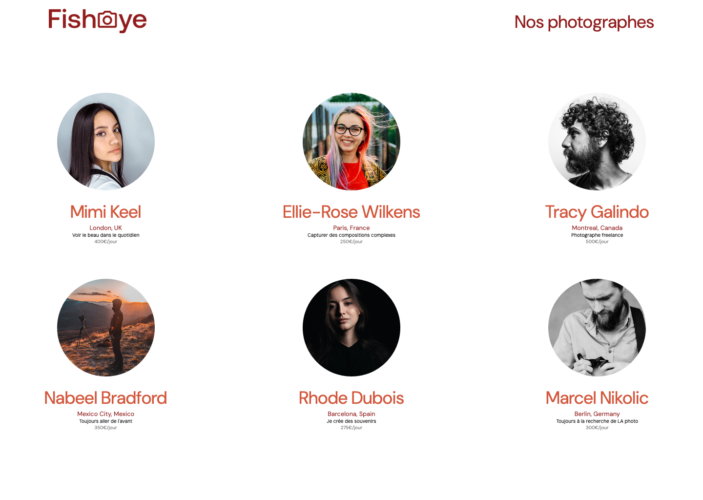
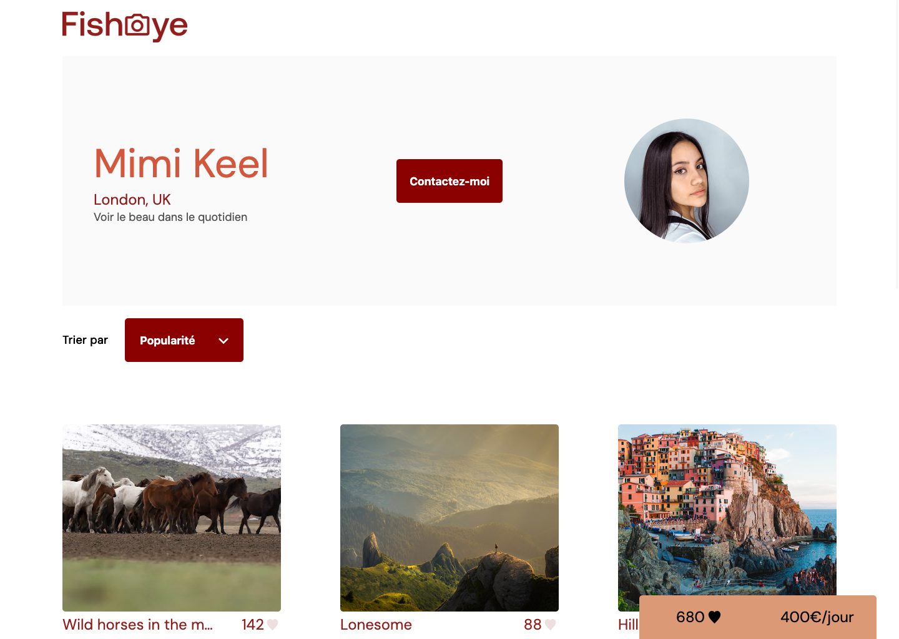

# OpenClassrooms – Project 6 FishEye

## 📌 Description

Source code of **Project 6 – FishEye**: _Create an accessible site for a photographer's platform_, completed as part of the **OpenClassrooms JavaScript React Developer path**.  

This was my **first project implementing a custom vanilla JavaScript router and a fully structured MVC architecture**, marking a significant step forward compared to the static or less modular projects completed earlier in the program.

⚠️ **Educational project**: This repository was created for learning purposes during my training. It is **not intended for production use**.

---

## 🎯 Learning Objectives

- Apply **web accessibility best practices** (ARIA roles, keyboard navigation, color contrast)
- Develop a modular application using **MVC architecture**
- Implement **design patterns** such as Factory Method and Dependency Injection
- Build a simple **vanilla JavaScript router** to handle navigation
- Manage events and interactions in a structured way

---

## 🔗 Provided Resources

- [Meeting notes](https://course.oc-static.com/projects/Front-End+V2/P5+Javascript+%26+Accessibility/Notes+de+reunion.pdf)
- [Approved design template on Figma](https://www.figma.com/file/Q3yNeD7WTK9QHDldg9vaRl/UI-Design-FishEye-FR?node-id=0%3A1)
- [Photos and videos assets](https://s3-eu-west-1.amazonaws.com/course.oc-static.com/projects/Front-End+V2/P5+Javascript+%26+Accessibility/FishEye_Photos.zip)
- [JSON data mockup](https://github.com/OpenClassrooms-Student-Center/Front-End-Fisheye/blob/main/data/photographers.json)
- [HTML and CSS base code](https://github.com/OpenClassrooms-Student-Center/Front-End-Fisheye)

---

## 👀 Preview

| Home page                                                  | Photographer's page                                                          | 
|------------------------------------------------------------|------------------------------------------------------------------------------|
|  |  | 

🔗 [Live preview](https://sedomu.github.io/oc_p6_fisheye/)

---

## 🏗 Project structure

### Files

- `index.html` → Application entry point (home page) 
- `photographer.html` → Photographer's details page
- `assets/` → fonts, icons, pictures
- `css/` → CSS files
- `data/` → JSON mockup data
- `scripts/` → JavaScript files

### Script structure

- `scripts/main.js`: application's entry point configuring a simple router, calling the `Controller`
- `scripts/Controller.js`: contains two methods triggered by the router based on the URL, calling the necessary Models and Vues.
- `scripts/Model.js`: handles the data and uses the **Factory Method** design pattern to manage different media types
- `scripts/vues/`: Views for the application
- `scripts/components/`: reusable scripts for recurring or complex UI components
- `scripts/services/`: utility functions used in the application

---

## 🛠 Tech stack

- HTML, CSS, JavaScript (Vanilla)
- Accessibility (WCAG 2.0 AA, ARIA)
- MVC + Design Patterns

This project adopts an MVC architecture with a simple Vanilla JavaScript router as an entry point for scripts. Modularity is ensured by fragmenting code into **components**, and design patterns such as **Dependency Injection** and **Factory Method** are applied in a practical, structured context.

---

## ✅ Code validation

The HTML and CSS code was validated using the official [W3C Markup Validator](https://validator.w3.org/nu/?doc=https%3A%2F%2Fsedomu.github.io%2Foc_p6_fisheye%2Findex.html) and [W3C CSS Validator](https://jigsaw.w3.org/css-validator/validator?uri=https%3A%2F%2Fsedomu.github.io%2Foc_p6_fisheye%2Findex.html&profile=css3svg&usermedium=all&warning=1&vextwarning=&lang=fr).

Accessibility was checked with [AChecks.org](https://www.achecks.org/) against **WCAG 2 AA** for both the [Home page](https://achecks.org/achecker#wcag2aa,https://sedomu.github.io/Front-End-Fisheye/) and the [Photographer's details page](https://achecks.org/achecker#wcag2aa,https://sedomu.github.io/Front-End-Fisheye/).

✅ No errors were reported.

---

## ⚙️ Installation

### 📋 Requirements

- None (only a web browser is required)

### 🚀 Steps

Clone the repository:

```bash
git clone https://github.com/sedomu/oc_p6_fisheye.git
```

Install a lightweight dev server (example with npm):

_You can use any lightweight dev server such as [http-server](https://www.npmjs.com/package/http-server) or [live-server](https://www.npmjs.com/package/live-server)._

```bash
npm install -g http-server
```

Start the server:

```bash
http-server .
```

Open the project in your browser:

```bash
open http://localhost:8080/
```

### 🤖 Deployment

This project is automatically deployed to GitHub Pages via a GitHub Actions workflow.
No manual deployment steps are required.

---

## 📜 Available scripts

Not applicable – no build tools or package managers required.

---

## ⚠️ Disclaimer

This project was created as part of the OpenClassrooms curriculum.
It is not optimized for production use. Some implementations may have been simplified to focus on specific learning goals.